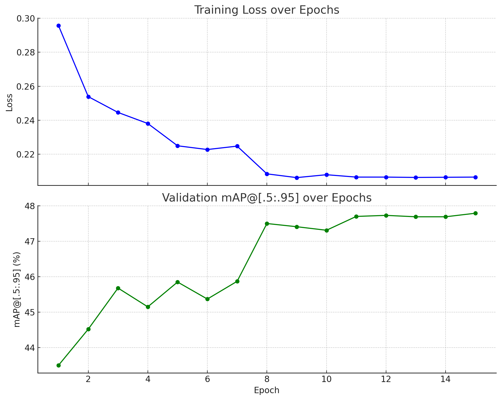

## NYCU Computer Vision 2025 Spring HW2        
Student ID: 110550124     
Name: 林家甫     

## Introduction 
The core objective of this homework is to use the Faster R-CNN machine learning model to detect digits (0–9) in the given images. Based on the coordinates of the detected digits, we then recognize the full number present in each image. The dataset consists of 30,062 training images, 3,340 validation images, and 13,608 test images.The data is provided in the COCO format, which is a standard format commonly used for object detection tasks.
   

## How to install 
Main Packages   
Dataset Link: https://drive.google.com/file/d/13JXJ_hIdcloC63sS-vF3wFQLsUP1sMz5/view?usp=sharing                
Pytorch: https://pytorch.org/        
Anaconda: https://www.anaconda.com/docs/getting-started/anaconda/install       

## Peformance Snapshot 
